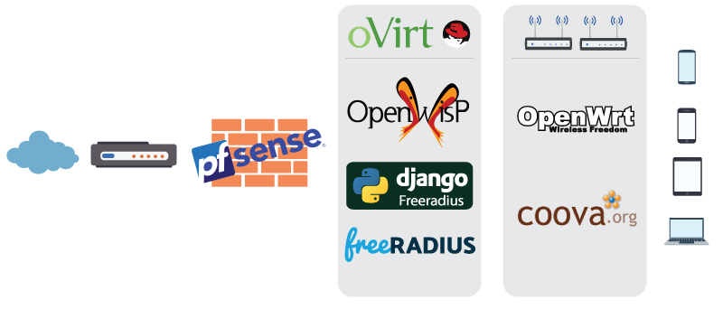

<h1>Le componenti</h1>

Per far fronte a tutte le nostre esigenze in modo scalabile, versatile, e sicuro è stato scelto **pfSense** per garantire la sicurezza e gestire i *DNS* (tramite **BIND9**) così da avere per ogni servizio gli *FQDN* (talvolta obbligatoriamente) adeguati e **oVirt** come sistema di virtualizzazione per poterci installare tutte le *VM* necessarie.

  

## 2.1 OpenWisp
OpenWISP è un progetto nato per permettere una semplice gestione di rete e permettere l’automazione sotto diversi aspetti come:

 - Auto configurazione dei nodi
 - Creazione di tunnel VPN
 - Inizializzazione di access point WiFi in modo centralizzato
 - Configurazione di reti mesh
 - Configurazione di ogni rete supportata da OpenWRT

L'applicazione server-side è modulare, estensibile, programmabile e configurabile. I moduli sono sviluppati con Django, un ricco ecosistema di componenti riutilizzabili soprattutto per applicazioni di rete.

Al momento solo OpenWRT è completamente supportato per uso in produzione, ma in modo sperimentale è disponibile anche il backend per Ubiquiti AirOS. Inoltre, l'engine permette la scrittura di configurazioni personalizzate su tutti gli OS di rete che supportano le configurazioni remote.

Il sistema è caratterizzato da due parti:

**OpenWISP Controller**, motore che genera configurazioni per router e dispositivi di rete utilizzando Python e NetJSON. La gestione è permessa grazie ad un interfaccia Web che permette la gestione della rete fornendo funzionalità di:

 - Registrazione degli apparati automatica
 - Mappe geografiche per posizionamento Indoor e Outdoor
 - VPN e certificati x509
 - Topologia di rete
 - RADIUS manager: django-freeradius
 - IP & subnet administration: django-ipam
 - Sistemi di controllo
 - Aggiornamento Firmware

**OpenWRT package**, pacchetto installabile su OpenWRT per permettere la sincronizzazione con il controller
## 2.2 OpenWRT
Il progetto OpenWrt è un sistema operativo Linux destinato a dispositivi embedeed. Invece di provare a creare un singolo firmware statico, OpenWrt fornisce un filesystem completamente scrivibile con gestione dei pacchetti. Questo libera dalla selezione e dalla configurazione dell'applicazione fornite dal venditore e consente di personalizzare il dispositivo attraverso l'uso di pacchetti per adattarsi a qualsiasi applicazione.

Per gli sviluppatori, OpenWrt è il framework per creare un'applicazione senza dover creare un firmware completo al suo interno; per gli utenti ciò significa la possibilità di personalizzazione completa, permettendo di adattarlo secondo le proprie esigenze.

OpenWRT ad oggi è supportato da oltre 1000 device. Consultando il sito del progetto è possibile verificarne la compatibilità e la procedura per sostituire il firmware stock.
## 2.3 FreeRADIUS
FreeRADIUS è la più popolare implementazione open-source del protocollo RADIUS. Permette l’autenticazione, l’autorizzazzione e l’accounting. Nel nostro caso a stretto contatto con django-freeradius autorizzerà la navigazione ad internet dopo essere passati dal nostro captive portal.
## 2.4 Django-Freeradius
E’ un’interfaccia web per gestire il database FreeRADIUS basata su Django. Necessaria per integrare le funzionalità di FreeRADIUS per poter gestire l’autorizzazione, la post autenticazione e l’accounting tramite API RESTful. Inoltre in questo caso è necessario per permettere la verifica tramite social grazie all’integrazione del modulo django-allauth.
## 2.5 CoovaChilli
CoovaChilli è un controller ricco di funzionalità che fornisce la possibilità di attivare un Captive Portal così da garantire l'accesso tramite protocollo RADIUS o HTTP permettendo l'access provisioning e l'accounting.
Questo controller è fruibile come package per Openwrt oppure è parte integrante del firmware CoovaAP.
Questo package sommato a Freeradius e Django-freeradius permetterà di raggiungere il nostro obbiettivo.
