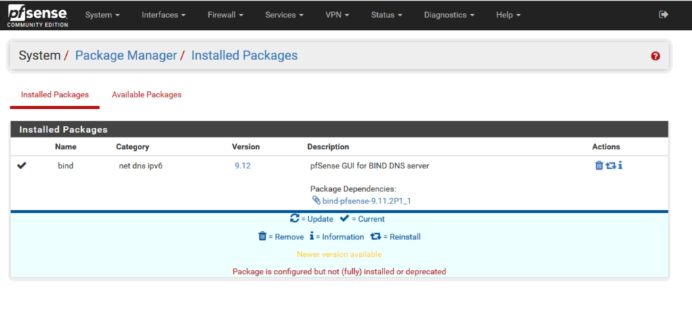
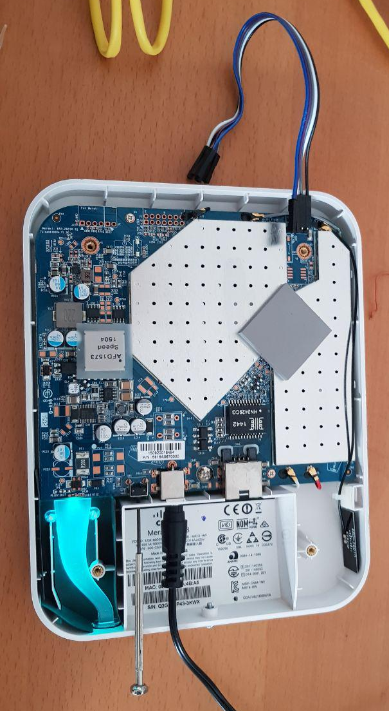
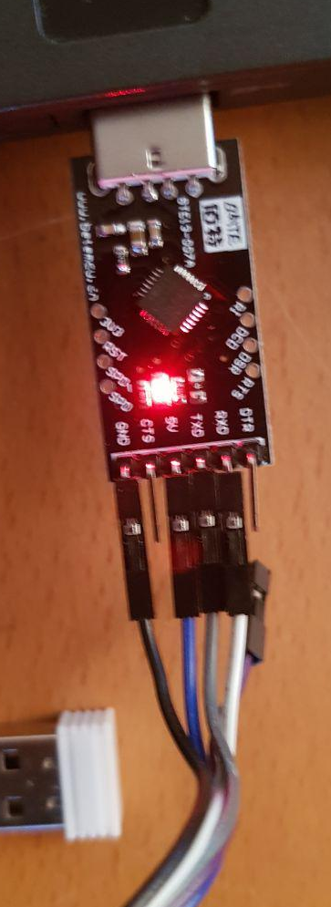
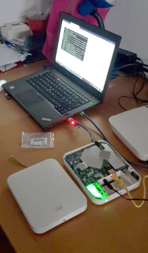
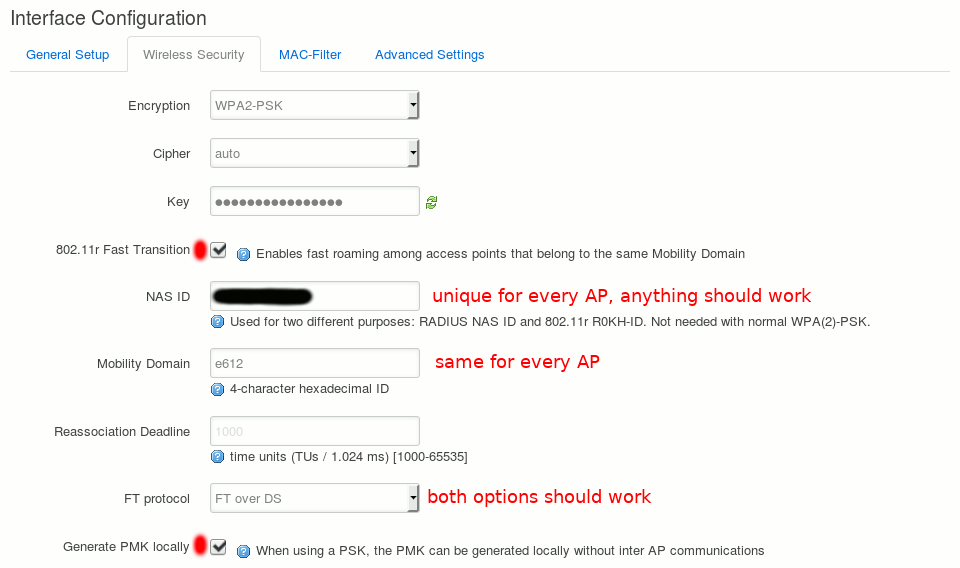

dn<style>
img[alt=ap1] { max-height:325px; }
img[alt=ap2] { max-height:325px; }
img[alt=ap3] { max-height:325px; }
img[alt=wroam] { max-height:450px; }

</style>
# 3.1 Server DNS: BIND9

!!! Note
    - Versione pfSense utilizzata durante la configurazione: **2.4.4**
    - Versione BIND9 installata: **9.12**
    - Si ringrazia il blog di [RaffaeleChiatto](https://www.raffaelechiatto.com/installazione-e-configurazione-di-bind-dns-su-pfsense/) per gli spunti

1. La prima operazione da effettuare è installare il package di BIND9      utilizzando il package manager di pfSense.
    

    **System** -> **Package Manager** quindi selezionare **Bind** e cliccare su **Install**

    L’installazione durerà qualche secondo e se tutto è andato a buon fine dovremmo vedere il BIND sotto gli Installed Packages:

    

2. Prima di procedere alla configurazione del BIND Server bisogna disattivare il **DNS Forwarder** e il **DNS Resolver**
3. Andare quindi nel menu a tendina sotto **Services** e selezionare **DNS Forwarder**
4. Togliamo la spunta a **Enable DNS forwarder** e cliccare su **Save**
5. Effettuare la stessa procedura anche con il DNS Resolver
6. Ritornare quindi al menù **Services** e cliccare su **BIND DNS Server**
7. Attivare il BIND spuntando Enable BIND DNS server.
8. Selzionare l’interfaccia sulla quale attivare il DNS (di solito la risoluzione DNS interna va attivata sull’interfaccia di LAN)
9. Nella sezione **Logging Options** abilitare i logs quindi selezionare l’opzione di **Default** se si vuole avere il log di tutto altrimenti selezionare l’opzione desiderata.
10. Per quanto riguarda le altre opzioni abilitare solo il forwarding cosi da poter risolvere tutto ciò che non è censito nelle zone interne con dei DNS pubblici.

    !!! Note "NOTA BENE"
        separare i DNS con un ; e inserire il ; anche alla fine dei DNS come mostrato nell’immagine sovrastante

11. A questo punto cliccare su **Save** per salvare la configurazione

12. Tornare in alto nella pagina di configurazione e cliccare sul link **Views** quindi cliccare sul pulsante **Add**

    !!! Note "NOTA BENE"
        la sezione ACLs è stata saltata perchè è una sezione che permette di fare configurazioni avanzate bloccando la risoluzione DNS solo a determinati IP o subnet.

13. Dare un nome alla Vista e una descrizione.
14. Settare la **Recursion** a **Yes**

    !!! Note "NOTA BENE"
        Una query ricorsiva si verifica quando il tuo server DNS viene interrogato per un dominio di cui attualmente non sa nulla, nel qual caso proverà a risolvere l’host dato eseguendo ulteriori query (ad es. Iniziando dai root server e risolvendo, o semplicemente passare la richiesta a un altro server DNS).

15. Impostare su **match-clients** e su **allow-recursion any** come mostrato in figura sovrastante.
16. Cliccare su **Save** per salvare le modifiche.
17. Tornare in alto nella pagina di configurazione e cliccare sul **link Views** quindi cliccare sul pulsante **Add**
18. Inserire il nome della zona interna e la descrizione
19. Come **Zone Type** impostare **Master**
20. Nel campo **View** selezionare **InsideView** creato in precedenza
21. Passare alla sezione **Zone Domain records** quindi inseriamo tutti i record che vogliamo risolvere dalla nostra zona interna definita in precedenza
22. Inserire nome e IP
23. Andare al fondo della pagina verificare il file di configurazione quindi cliccare su **Save** per salvare le impostazioni
24. A questo punto la configurazione del server BIND è terminata
25. Andiamo nel menù **Status -> Services**
26. Riavviamo il servizio **named** cliccando sul tasto a forma di **freccia circolare**

!!! Attenzione!
    Per tutti i passaggi successivi assicurarsi che la risoluzione dei nomi avvenga correttamente su tutti gli host

# 3.2 Flash di OpenWRT

!!! Note
    la nostra rete è caratterizzata da 5 Access Point Cisco Meraki MR18. [Come da documentazione ufficiale,](https://openwrt.org/toh/meraki/mr18) esistono in base alla versione firmware installata 3 metodi per il flashing di seguito esplicito il metodo C in quanto è il nostro caso.

!!! Note "Requisiti"

    - Router oppure DHCP Server
    - Web server
    - Adattatore UART

1. Collegamento adattatore UART al Meraki MR18.

      


2. Collegare all' MR18 a un router (con DHCP attivo) tenendolo scollegato Internet. Questo è fondamentale per questo exploit.
3. Tenere premuto il pulsante di reset sul MR18 per 10 secondi. Si dovrebbe vedere il led lampeggiare e poi spegnere. Una volta spento il LED, è possibile interrompere la pressione sul pulsante di reset. In questo modo viene eseguito un ripristino di "Livello 2" e vengono rimosse tutte le configurazioni dal punto di accesso.
4. Collegare l'adattatore UART dall' MR18 al PC
5. Collegare il PC allo stesso router utilizzato da MR18. Quindi, ricordare l'indirizzo IP asseganto al PC. In questo esempio verrà usato 192.168.1.102.
6. Una volta avviato l' MR18, avviare un server HTTP (sulla porta 80) sul PC nella stessa directory del file del firmware.
7. Avviare putty (su windows) oppure un accesso seriale utilizzando l’adattatore. Una volta fatto l’accesso, è possibile caricare questa immagine nella partizione "part2" sul MR18. Questa operazione viene eseguita digitando il seguente comando:

    ```
    odm firmware part2 192.168.1.102:80/lede-ar71xx-nand-mr18-initramfs-kernel.bin
    ```

    !!! Note
        Si noti che il comando precedente potrebbe andare in timeout, a seconda dello stato del router durante il processo di avvio. Se si verifica il timeout o non riesce, è sufficiente attendere 60 secondi e riprovare. Normalmente il momento migliore per eseguire il comando è quando il LED sul MR18 è verde o lampeggiante arancione.

8. Una volta completato, rimuovere l'alimentazione dal Meraki MR18. Dopo che l'alimentazione viene rimossa, nella sessione UART tenere premuto "2" sulla tastiera fino a quando non viene rimessa l'alimentazione. Questo dovrebbe ora avviare l'immagine initramfs appena caricata sul MR18.
9. Scollegare il MR18 dal router e collegare direttamente il computer ad esso. Una volta collegato, si dovrebbe ottenere un IP dal MR18.
10. Ora che il firmware è stato caricato, aprire un browser sul computer e passare a http://192.168.1.1. Una volta effettuato l'accesso a LuCI, è possibile caricare una versione più aggiornata del firmware scaricandola dal sito ufficiale.
11. Una volta caricato, il MR18 dovrebbe riavviarsi ed essere completamente in esecuzione OpenWrt/LEDE

<h3>Installazione pacchetti e configurazioni aggiuntive</h3>
Per abilitare l'HTTPS sull'interfaccia web:
```bash
opkg install luci-ssl
```
Installazione Coovachilli (per attivare il captive portal)
```bash
opkg install coova-chilli
```
Rimozione wpad-mini e Installazione di per abilitare il protocollo 802.11r
```bash
opkg remove wpad-mini
opkg install wpad
```


- Settaggio indirizzo ip
- Settaggio hostname con il relativo inserimento nella zona DNS

!!! warning "Progetti tuttora in sviluppo"
    Per le componenti elencate nei prossimi 3 paragrafi considerando che la comunità di OpenWisp allo stato attuale (a parte il controller) sono ancora in via sviluppo è stato deciso di separarli installando ogni componente in una VM separata (Ubuntu Server 18.04.3)

# 3.3 Deploy OpenWISP Controller

!!! Documentazione e materiale ufficiale
    -  [Sito ufficiale](https://openwrt.org/toh/meraki/mr18)
    -  [GitHub - OpenWisp Controller (ansible)](https://github.com/openwisp/ansible-openwisp2)
    -  [GitHub - OpenWisp Package](https://github.com/openwisp/openwisp-config)
    -  [Elenco progetti OpenWisp](https://github.com/openwisp/)

Per agevolare l'installazione del controller in produzione la comunità di OpenWisp ha deciso di utilizzare ansible, un software libero che consente di automatizzare le procedure di configurazione e gestione sui sistemi unix-like e Windows.

Per l'installazione tramite ansible è necessario definire due concetti chiave:

- "Server di produzione": Nel nostro caso la VM con Ubuntu Server 18.04, 192.168.3.100, openwisp.planet.bn
- "Macchina locale": ci si riferisce all'host che verrà utilizzato per inviare l'installazione e le configurazioni al server di produzione

Ansible è uno strumento di gestione della configurazione che funziona collegandosi ai server di produzione tramite SSH, quindi è necessario installarlo e configurarlo sulla computer che abbiamo definito "Machina locale":


```bash

# Installazione di ansible
    sudo apt update
    sudo apt install git
    sudo apt install software-properties-common
    sudo apt-add-repository --yes --update ppa:ansible/ansible
    sudo apt install ansible

# Installazione in ansible i ruoli per poter effettuare la installazione
    ansible-galaxy install openwisp.openwisp2

# Creo una cartella per poi inserire i file di configurazione
    mkdir ~/openwisp
    cd ~/openwisp
    touch playbook.yml
    touch hosts

# Creazione della chiave per autenticarsi al server di produzione senza password
       ssh-keygen
       ssh-copy-id <user>@<FQDN>

# Eseguire Ansible per iniziare l'installazione.
# Sostituire <user> con l’utente in uso sulla macchina di produzione
# a cui gli si chiederà di installare il controller
       ansible-playbook -i hosts playbook.yml -u <user> -k --become -K

```

```yaml
# playbook.yml

- hosts: openwisp.planet.bn
  become: "{{ become | default('yes') }}"
  roles:
    - openwisp.openwisp2
  vars:
    openwisp2_network_topology: true
    openwisp2_default_from_email: bunkernet@oratoriopandino.it
```

```bash
# hosts

[openwisp2]
openwisp.planet.bn
```
Accedere infine alla web gui e cambiare la password di default (admin - admin). Recuperare poi il codice organizzazione e completare i campi vuoti (necessario per i prossimi passaggi,
    ```
    Home › Users and Organizations › Organizations)
    ```
    )

<h3>Preparazione Access Point per la connessione</h3>
Per cmpletare la sincronizzazione è necessario accedere via SSH ad ogni Access Point che si desidera collegare.

1. Installare il seguente pacchetto
    ```
    opkg install http://downloads.openwisp.io/openwisp-config/latest/openwisp-config-nossl_0.4.6a-1_all.ipk
    ```

2. Modificare il file */etc/config/openwisp*

```no-highlight
config controller 'http'
option url 'https://openwisp.planet.bn'
option shared_secret ‘’
option verify_ssl '0'
option mac_interface 'eth0'
option uuid ''
option key ''
```

Tale configurazione indica i parametri di connessione al controller che per poter rimanere autenticato deve ricevere tali configurazioni:

- **url**: FQDN del controller
- **shared_secret**: chiave del controller
- **verify_ssl**: 1 se è presente un certificato firmato, 0 se il certificato è self-signed
- **mac_interface**: nome dell’interfaccia dell’AP da cui lo script registrazione preleverà il mac address che verrà utilizzato per generare automaticamente le chiavi univoche uuid,key

Infine, aprire due shell e inserire rispettivamente

```bash
# Per monitorare se la registrazione al controller avviene correttamente:
    logread -f | grep openwisp

# Per avviare il demone di OpenWISP:
    /etc/init.d/openwisp_config start
```
# 3.4 Installazione django-freeradius

!!! Note "Documentazione ufficiale"
    [ReadTheDocs](http://django-freeradius.readthedocs.io/)

!!! Note
    - Versione di python utilizzata: **3.6.5**
    - E' verificabile digitando
    ```
    python3 --version
    ```

Con l'avvento di Python3 è diventato fortemente consigliato di fare uso dei Virtual Environment.
Virtual Environment sta per Ambiente Virtuale, e si tratta di una best practice che ci permette di creare degli spazi indipendenti dal resto del sistema in cui è possibile testare e lavorare con Python e pip.
La grande popolarità degli Ambienti Virtuali, è dovuta al fatto che ci consentono di lavorare e sperimentare con più progetti contemporaneamente nonostante magari questi utilizzino una versione diversa degli stessi moduli. Inoltre ci permettono di installare moduli con pip senza i privilegi di root, con tutti i vantaggi in termini di sicurezza che questo comporta.

Di seguito quindi la preparazione di un ambiente virtuale con le relative librerie necessarie.

```bash
sudo apt install python3-pip
sudo apt install python3-venv
sudo apt install sqlite3 libsqlite3-dev
sudo apt install libmysqlclient-dev
mkdir environments
cd environments
python3 -m venv radius_env
source radius_env/bin/activate
(radius_env) bobby@bobby:~/environments$ pip install django
```

Creato l'ambiente, installato Django, si può procedere all'installazione del database di cui django-freeradius ne farà uso.
```bash
sudo apt install postgresql
sudo apt install postgresql-server-dev-10
sudo -i -u postgres
createuser -S djangoradius -P
createdb jradius_db -O djangoradius
```
Creazione del progetto e installazione librerie necessarie
```django
django-admin startproject djangoradius
cd djangoradius
pip install psycopg2
pip install https://github.com/openwisp/django-freeradius/tarball/master
pip install --upgrade http://github.com/openwisp/openwisp-utils/tarball/master
pip install wheel
pip install django-allauth
```
Applicazione delle modifiche e creazione utente superuser

```django
./manage.py migrate
./manage.py createsuperuser
```
Modificare il file settings.py come in seguito:

```no-highlight
ALLOWED_HOSTS = ['192.168.3.102:8000']
INSTALLED_APPS = [
    #OtherApps
    'django_freeradius',
    'django_filters',
]
DJANGO_FREERADIUS_API_TOKEN = '165f9a790787fc38e5cc12c1640db2300648d9a2'
DATABASES = {
    'default': {
        'ENGINE': 'django.db.backends.postgresql_psycopg2',
        'NAME': 'jradius_db',
        'USER': 'djangoradius',
        'PASSWORD': 'pwddb',
        'HOST': '127.0.0.1',
        'PORT': '5432'
    },
}
```
urls.py
```no-highlight
from django.conf.urls import include
```

Installato e configurato il necessario, è possibile avviare il server

```django
python manage.py runserver 192.168.1.56:8000
```
# 3.5 Preparazione del Captive Portal

Affinchè django-freeradius autorizzi gli utenti a navigare è necessario che comunichi con le rispettive API dei social network e per fare ciò è richiesto che django utilizzi una connessione HTTPS.
Un qualsiasi progetto django di default utilizza una connessione HTTP, di seguito la procedura per convertirlo in HTTPS (Fonte [GitHub](https://gist.github.com/claudiosanches/7012524))
```no-highlight
sudo apt install stunnel
```

Spostarsi nella cartella del progetto in cui risiede il file ```manage.py```
```no-highlight
cd /home/openwisp/djangoRadius/djangoradius
mkdir stunnel
cd stunnel
```

Creare la chiave
```no-highlight
openssl genrsa 1024 > stunnel.key
openssl req -new -x509 -nodes -sha1 -days 365 -key stunnel.key > stunnel.cert
cat stunnel.key stunnel.cert > stunnel.pem
```

Creare un file di nome  ```dev_https``` con contenuto:
```no-highlight
pid=
cert = stunnel.pem
sslVersion = SSLv3
foreground = yes
output = stunnel.log

[https]
accept=8000
connect=8001
TIMEOUTclose=1
```

Ritornare nella cartella del ```manage.py``` e creare un file di nome ```runserver``` con i permessi di esecuzione
```no-highlight
stunnel4 stunnel/dev_https &
python manage.py runserver&
chmod a+x runserver
```

**Installazione di django-allauth**

Il social login è supportato generando un token temporaneo dopo che l'utente ha effettuato un login corretto, l'utente è poi reindirizzato alla pagina di captive portal con 2 parametri: username e token.
La pagina di captive portal riconosce questi due parametri e lo username è ovviamente usato per il campo username mentre il token per il campo password.
Le API REST interne di django-freeradius riconosceranno il token e lo autorizzeranno
questo tipo di implementazione permette di implementare qualsiasi social login che già supporta il protocollo RADIUS perchè è totalmente trasparente per esso. Di seguito la procedura per integrare il social login:

Questa procedura prende come esempio l'integrazione con facebook
```no-highlight
pip install django-allauth
```

Assicurarsi che il file ```settings.py``` sia come il seguente

```no-highlight
INSTALLED_APPS = [
    # ... other apps ..
    # apps needed for social login
    'rest_framework.authtoken',
    'django.contrib.sites',
    'allauth',
    'allauth.account',
    'allauth.socialaccount',
    # showing facebook as an example
    # to configure social login with other social networks
    # refer to the django-allauth documentation
    'allauth.socialaccount.providers.facebook',
]

SITE_ID = 1

# showing facebook as an example
# to configure social login with other social networks
# refer to the django-allauth documentation
SOCIALACCOUNT_PROVIDERS = {
    'facebook': {
        'METHOD': 'oauth2',
        'SCOPE': ['email', 'public_profile'],
        'AUTH_PARAMS': {'auth_type': 'reauthenticate'},
        'INIT_PARAMS': {'cookie': True},
        'FIELDS': [
            'id',
            'email',
            'name',
            'first_name',
            'last_name',
            'verified',
        ],
        'VERIFIED_EMAIL': True,
    }
}
```

Assicurarsi che il file ```urls.py``` contenga anche allauth.urls:

```no-highlight
urlpatterns = [
    # .. other urls ...
    url(r'^accounts/', include('allauth.urls')),
]
```
Infine come spiegato in [questo video](https://www.youtube.com/watch?v=mmHn5XYlgto), la procedura per abilitare e configurare un account facebook developer e collegarlo a django-freeradius.

**Esempio di Captive Page**

```no-highlight
<a href="https://cportal.planet.bn:8000/accounts/facebook/login/?next=%2Ffreeradius%2Fsocial-login%2F%3Fcp%3Dhttps%3A%2F%2Fcportal.planet.bn%2F%26last%3D"
   class="button">Log in with Facebook
</a>
```


# 3.6 Installazione FreeRADIUS 3

In questa parte viene spiegato come installare e configurare freeradius3 per renderlo funzionante con django-
freeradius.

!!! Note
    - Questa procedura è stata scritta per essere eseguita su Ubuntu 18.04, per altre distribuzioni linux il nome dei package e i percorsi potrebbero variare. Per ulteriori chiarimenti consultare la [documentazione ufficiale](http://freeradius.org/documentation/)

Prima di tutto, diventare root

```no-highlight
sudo -s
```

Installazione pacchetti necessari e configurazione del database (In questo caso, PostgreSQL)
```no-highlight
apt update
apt install freeradius freeradius-rest
apt install freeradius-postgresql
sudo apt install postgresql
sudo -i -u postgres
createuser -S freeradius -P
createdb radius -O freeradius
exit
```

**Attivazione moduli necessari**

ln -s /etc/freeradius/mods-available/sql /etc/freeradius/mods-enabled/sql
ln -s /etc/freeradius/mods-available/rest /etc/freeradius/mods-enabled/rest

**Configurazione del modulo sql**

Una volta configurato correttamente un SQL server è necessario configurare il modulo sql con il driver da utilizzare, il dialect, indirizzo del server, username, password e il nome del database da creare. Quindi accedere al file ```/etc/freeradius/3.0/mods-available/sql``` e cercare:
```no-highlight
driver = "rlm_sql_postgresql"
dialect = "postgresql"
# Connection info:
server = "localhost"
port = 5432
login = "<user>"
password = "<password>"
radius_db = "radius"
```
**Configurazione del modulo sqlcounter**

Il modulo sqlcounter è usato per forzare il limite di sessione. Accedere al file ```etc/freeradius/mods-available/3.0/sqlcounter``` e modificarlo come segue:
```no-highlight
    # The dailycounter is included by default in the freeradius conf
    sqlcounter dailycounter {
        sql_module_instance = sql
        dialect = ${modules.sql.dialect}
        counter_name = Daily-Session-Time
        check_name = Max-Daily-Session
        reply_name = Session-Timeout
        key = User-Name
        reset = daily
        $INCLUDE ${modconfdir}/sql/counter/${dialect}/${.:instance}.conf
    }
    # The noresetcounter is included by default in the freeradius conf
    sqlcounter noresetcounter {
        sql_module_instance = sql
        dialect = ${modules.sql.dialect}
        counter_name = Max-All-Session-Time
        check_name = Max-All-Session
        key = User-Name
        reset = never
        $INCLUDE ${modconfdir}/sql/counter/${dialect}/${.:instance}.conf
    }
    # The dailybandwidthcounter is added for django-freeradius
    sqlcounter dailybandwidthcounter {
        counter_name = Max-Daily-Session-Traffic
        check_name = Max-Daily-Session-Traffic
        sql_module_instance = sql
        key = 'User-Name'
        reset = daily
        query = "SELECT SUM(acctinputoctets + acctoutputoctets) \
        FROM radacct \
        WHERE UserName='%{${key}}' \
        AND UNIX_TIMESTAMP(acctstarttime) + acctsessiontime > '%%b'"
    }
```
Una volta configurato il file come sopra è necessario attivare il modulo con una procedura particolare in quanto a causa di un bug non è possibile attivare tale modulo come tutti gli altri (es. sql e rest)
accedere a ```/etc/freeradius/3.0/radiusd.conf``` e aggiungere come segue sqlcounter
```no-highlight
    modules {
        # ..
        $INCLUDE mods-enabled
        $INCLUDE mods-available/sqlcounter
        # ..
    }
```
**Configurazione del modulo REST**

modificare ```/etc/freeradius/3.0/mods-enabled/rest``` sostituendo ```<url>``` con l'url usato dal proprio progetto django
```no-highlight
    connect_uri = "http://127.0.0.1:8000"
    authorize {
        uri = "${..connect_uri}/api/v1/authorize/"
        method = 'post'
        body = 'json'
        data = '{"username": "%{User-Name}", "password": "%{User-Password}"}'
        tls = ${..tls}
    }
    # this section can be left empty
    authenticate {}
    post-auth {
        uri = "${..connect_uri}/api/v1/postauth/"
        method = 'post'
        body = 'json'
        data = '{"username": "%{User-Name}", "password": "%{User-Password}", "reply": "%{reply:Packet-
        Type}", "called_station_id": "%{Called-Station-ID}", "calling_station_id": "%{Calling-Station-ID}"}'
        tls = ${..tls}
    }
    accounting {
        uri = "${..connect_uri}/api/v1/accounting/"
        method = 'post'
        body = 'json'
        data = '{"status_type": "%{Acct-Status-Type}", "session_id": "%{Acct-Session-Id}", "unique_id": "%
        {Acct-Unique-Session-Id}", "username": "%{User-Name}", "realm": "%{Realm}", "nas_ip_address": "%{NAS-IP-
        Address}", "nas_port_id": "%{NAS-Port}", "nas_port_type": "%{NAS-Port-Type}", "session_time": "%{Acct-
        Session-Time}", "authentication": "%{Acct-Authentic}", "input_octets": "%{Acct-Input-Octets}",
        "output_octets": "%{Acct-Output-Octets}", "called_station_id": "%{Called-Station-Id}",
        "calling_station_id": "%{Calling-Station-Id}", "terminate_cause": "%{Acct-Terminate-Cause}",
        "service_type": "%{Service-Type}", "framed_protocol": "%{Framed-Protocol}", "framed_ip_address": "%
        {Framed-IP-Address}"}'
        tls = ${..tls}
    }
```
**Configurazione del sito**

Cinfigura le sezioni ```authorize```, ```authenticate``` e ```postauth``` come segue sostituendo <api_token> con il valore della variabile [DJANGO_FREERADIUS_API_TOKEN](https://django-freeradius.readthedocs.io/en/latest/general/api.html#api-token) inserita nel file settings.py
Aprire quindi ```/etc/freeradius/sites-enabled/default```
```no-highlight
    api_token_header = "Authorization: Bearer <api_token>"
    authorize {
        update control { &REST-HTTP-Header += "${...api_token_header}" }
        rest
        sql
        dailycounter
        noresetcounter
        dailybandwidthcounter
    }
    # this section can be left empty
    authenticate {}
    post-auth {
        update control { &REST-HTTP-Header += "${...api_token_header}" }
        rest
        Post-Auth-Type REJECT {
            update control { &REST-HTTP-Header += "${....api_token_header}" }
            rest
        }
    }
    accounting {
        update control { &REST-HTTP-Header += "${...api_token_header}" }
        rest
    }
```
assicurarsi che nella sezione ```preacct``` ci sia ```acct_unique```
```no-highlight
    preacct {
        # ...
        acct_unique
        # ...
    }
```
Riavviare freeradius per rendere effettiva la nuova configurazione
```no-highlight
    service freeradius restart
    # oppure
    systemctl restart freeradius
```

In caso di errori avvia freeradius in modalità debug.
```no-highlight
    freeradius -X
    # oppure
    freeradius -Xx
```
